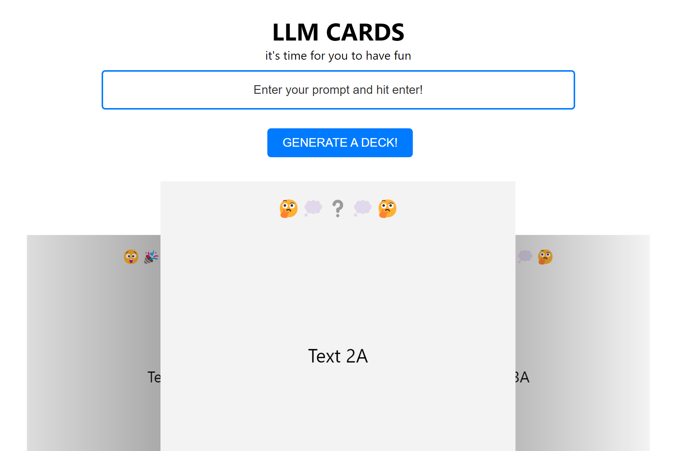

# React Front-End for the AI Cards app.

This is an example front-end created with React for the AI Cards FastAPI application.

## How to Use

To get started use `npm install` in your project directory, then simply run `npm start`. This will launch the app in development mode. You can view it in your browser at [http://localhost:3000](http://localhost:3000). The page will automatically reload if you make any changes, and you'll see lint errors in the console.

## Additional Setup

For more functionality and styling, run these commands:

- `npm install react-slick slick-carousel`
- `npm install react-grid-gallery`
- `npm install tailwindcss postcss autoprefixer -D`

## Development Notes

- Explored CORS settings for secure data exchange.
- Encountered issues while setting up the Dockerfile. The current version bypasses the build process due to challenges with excluding `node_modules`. A build version for production deployment is planned for future updates.
- Gained better understanding of websockets and experimented with them.
